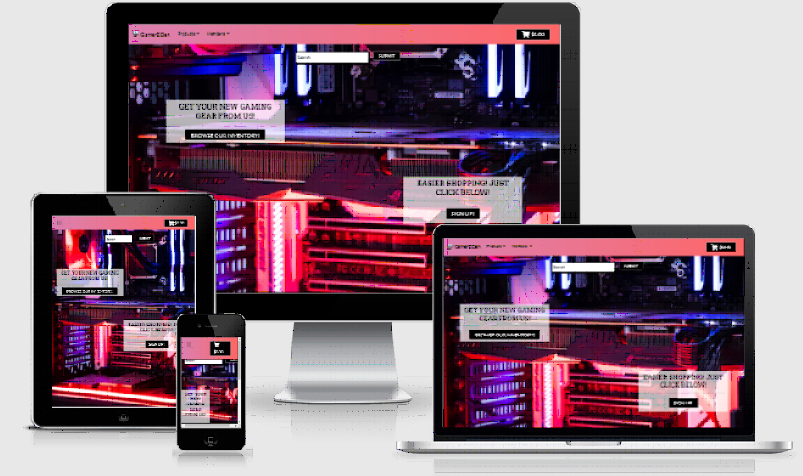
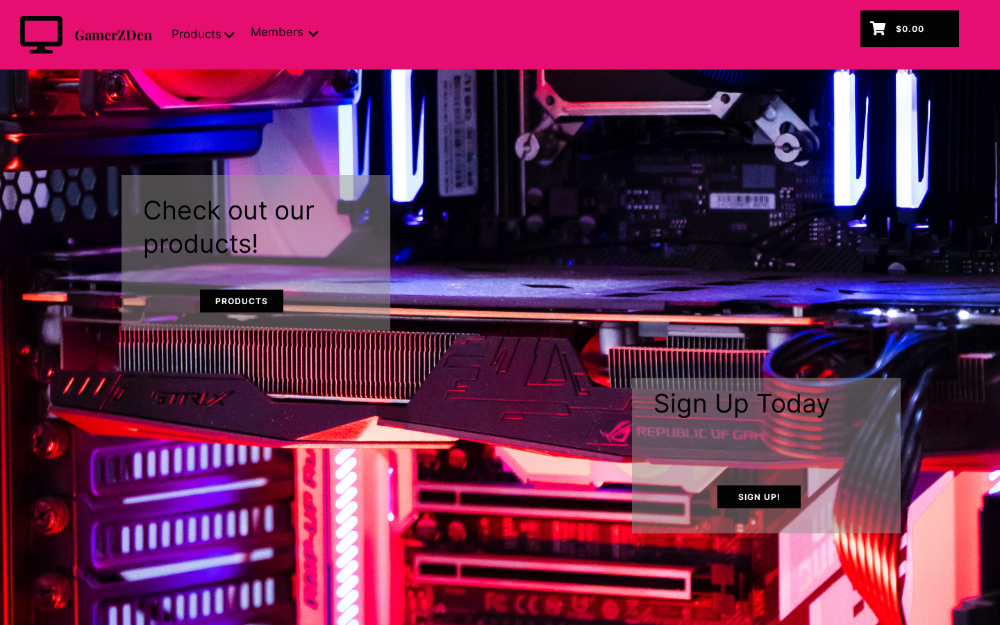
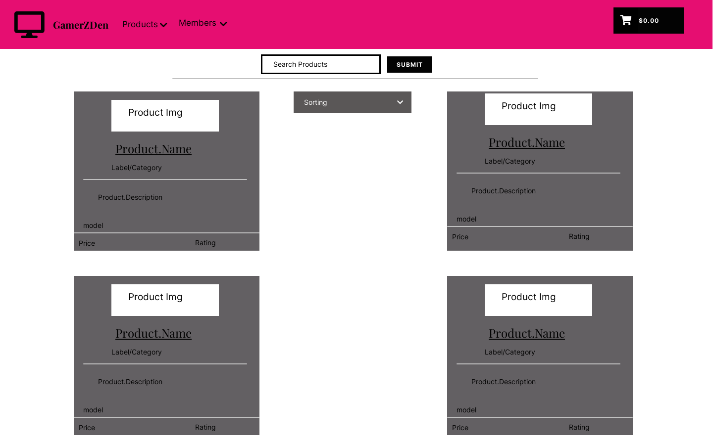
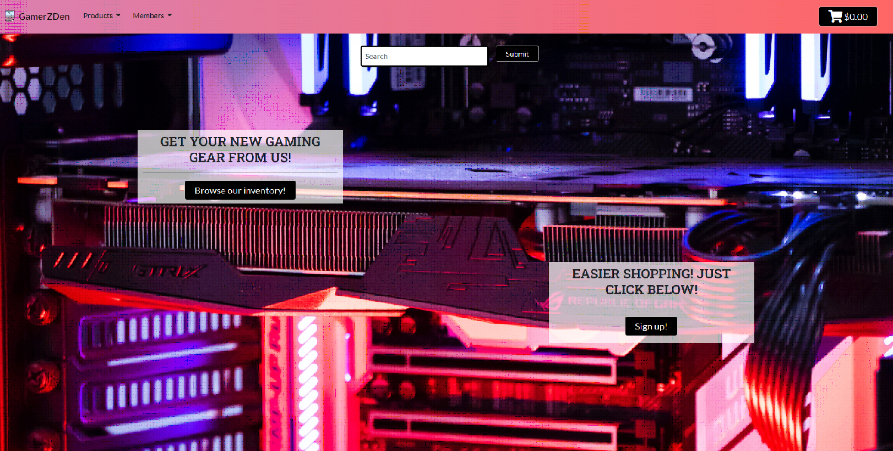

# GamerZDen

- [UX](#ux)
  - [Project Goal](#project-goal)
  - [User Stories](#user-stories)
    - [User Stories for Customers](#user-stories-for-customers)
    - [User Stories for Shop Administrators](#user-stories-for-shop-administrators)
  - [Data Structure](#data-structure)
  - [Design](#design)
    - [Fonts](#fonts)
    - [Colors](#colors)
    - [Wireframes](#wireframes)
- [Features](#features)
  - [Existing Features](#existing-features)
    - [Home Page](#home-page)
    - [Product Listing](#product-listing)
    - [Product View](#product-view)
    - [User Account](#user-account)
    - [Shopping Cart](#shopping-cart)
    - [Payment](#payment)
    - [Administrator features](#administrator-features)
  - [Features Left to implement](#features-left-to-implement)
- [Testing](#testing)
- [Deployment](#deployment)
  - [Local Deployment](#local-deployment)
  - [Deployment to Heroku](#deployment-to-heroku)
- [Technologies](#technologies)
- [Tools Used](#tools-used)
- [Credits](#credits)
  - [Media](#media)
  - [Acknowledgements](#acknowledgements)
- [Bugs](#bugs)

---

Info about the site



The site has been deployed to Heroku and can be viewed [here](https://gamerzden.herokuapp.com/).

## UX

### Project Goal

This is my fifth and final project during my course at CodeInstitute. The goal was to create an e-commerce site 
using django framework. Implementing stripe for payments and AWS for file storing. Then deploy it to heroku.


### User Stories

#### User Stories for Customers

| **As a customer I would like to**                  | **So that I can**                             |
| -------------------------------------------------- | --------------------------------------------- |
| Browse products                                    | purchase what I need                          |
| Search products                                    | find something specific                       |
| Filter products by price, name or category         | compare the prices                            |
| Buy a product                                      | so that I can upgrade my gear                 |
| Pay using a card                                   | complete my purchase                          |
| Create a profile                                   | save my information and review past orders    |
| Update my profile information                      | I can auto-fill my info during checkout       |
| See my shopping cart before paying                 | know the cost and evaluate my added products  |
| Update my shopping cart                            | change products without starting over         |
| See details about a product                        | make an informed decision                     |
| View my order history                              | find an order in case of warranty claim       |
| Receive an email confirmation about my order       | have archived information about it            |
| Contact the shop                                   | know about the status of an order             |


#### User Stories for Shop Administrators

| **As an administrator I would like to**     | **So that I can**                                |
| ------------------------------------------- | ------------------------------------------------ |
| Add a product                               | update with the latest deals                     |
| Update a product                            | change prices, descriptions and other criteria   |
| Remove a product                            | remove products not for sale anymore             |


### Data Structure

    Before starting the development of the application, models and their relationships were planned.

-   Click [here](readme-files/flowchart.png) to view the flowchart!


### Design

This application was styled using bootstrap for a better responsive design.
Colors has been selected carefully to match and make it easy to read.

#### Fonts

Two fonts from [Google Fonts](https://fonts.google.com/) were used throughout the site:

1. **Roboto Slab** was used for all the headings

1. **Lato** was used for all the content with different weights.


#### Colors

A simple color scheme was used to enhance readability and usability.

-   For the index site I choose a colorful background which matches but doesn't melt in with my header.
    I also tested the contrast between my colors using [Contrast Checker](https://webaim.org/resources/contrastchecker/)  
    Contrast images can be found [here](readme-files/color_contrast.pdf)
-   Then for the main parts of the site I choose to go with a white background. This to not steal attention from our products which are the main thing in the site.

#### Wireframes

-  Wireframes were made as a way to guide through out the creation of the application.
-  
-  
    There are many more to view however I do not wanna fill this document with only pictures.
    To view the others either click the link below or locate readme-files in my [repository](https://github.com/Knasten/Project_5)
-   [Wireframes](readme-files/wireframes.pdf)


## Features

### Existing Features

#### Home Page

-   The home page displays a header with different links depeding on if logged in or not
    Also depending on what type of account, for example if superuser or shopper
-   The home page also consist of a nice background with two different links
    to faster access the shop, make an account or login

#### Product Listing

The shop offers a number of solutions to make specific products easier to list and find.

-   A search function lets users find specific products, searches in name, description and SKU fields
-   A product listing can be sorted by price, category, name or rating
-   A product listing can be filtered by category | [Data Structure](#data-structure)

#### Product View

-   A user can view the details of a product, which includes the following:
    -   Product name
    -   Image
    -   Make
    -   Model
    -   Description
    -   Rating
    -   SKU
    -   Price
-   Users can choose a quantity and add it to their cart


#### User Account

The creation of an account requires a valid email, a username, and a password.
The creation of an account gives access to the following features:

-   Update of profile information
-   View the account's order history
-   Auto population of form fields during checkout

#### Shopping Cart

-   Items chosen for purchase are placed in the shopping cart
-   The shopping cart displays subtotals for items placed in it and a grand total cost
-   Quantities for the products can be adjusted from within the shopping cart
-   Items can be removed from the shopping cart
-   A user can choose to proceed to payment
-   Sends email with the order confirmation.

#### Payment

-   The checkout details and delivery information are pre-filled with the information provided in the user's profile, it can however be edited.
    (If saved since before.)
-   A summary of the order is displayed on the checkout page
-   Payment is made by card using [Stripe](https://stripe.com/)

#### Administrator features

-   On product pages, an administrator has additional links to edit a products information or remove it from the shop


### Features Left to implement

-   More payment options during checkout adding paypal would be great
-   Social account login
-   A way for the site owner to confirm and auto send mail when order is packaged and sent to customer

## Testing

# Testing was done manually throughout the development process. Just some of the testing below:

-   I have tested form submission both from webhooks and directly with javascript  
    This was tested by commenting out javascript form submission and then checking admin for orders
-   Profile saving was tested by making a purchase then checking admin if profile updated
-   Auto population of checkout fields was tested by making a purchase when profile information already was updated
-   Webhooks have been tested by making purchases with and without form submit active.  
    This to make sure the webhook handles form validation in case of any unforseen mistakes from server or customer side.
-   All views has been tested by visiting every assigned url
-   All links has been tested by clicking, making sure you can flow through the site.

Additionally, all code was validated in the following ways:

**HTML** - All pages were successfully run through the [W3C HTML Validator](https://validator.w3.org/) to ensure compliance with the standards set by the W3C.

**CSS** - CSS validation with the [W3C Jigsaw Validator](https://jigsaw.w3.org/css-validator/) Other than that, the code complies to the W3C standards.

**Python** - All Python code was checked with the [PEP8 online validator](http://pep8online.com/) and is PEP8 compliant, aside from line length flags, which were left for code readability.

## Deployment

Before deploying the application, ensure the following are installed:

-   Python 3
-   Gunicorn
-   psycopg2
-   Stripe
-   Postgres
-   Django
-   dj-database-url
-   PIP
-   Git
-   Heroku CLI

The application relies on the following services, and accounts will have to be created for them:

-   [Amazon AWS](https://aws.amazon.com/)
-   [Stripe](https://stripe.com/) for payment
-   An email account, [Gmail](https://mail.google.com/) for sending and receiving emails.

### Local Deployment

These are the steps to deploy GamerZDen locally.

1.  From the application's [repository](https://github.com/Knasten/Project_5), click the "code" button and download the zip of the repository.

    Or, you can clone the repository by typing the following line in your terminal:

        git clone https://github.com/Knasten/Project_5.git

2.  Access the folder in your terminal window and install the application's required modules using the following command:

        pip3 -r requirements.txt

3.  Create a file containing your environmental variables called `env.py` at the root level of the application. It will need to contain the following lines and variables:

    ```
    import os

    os.environ["SECRET_KEY"] = "YOUR_DJANGO_SECRET_KEY"

    os.environ["STRIPE_PUBLIC_KEY"] = "YOUR_STRIPE_PUBLIC_KEY"
    os.environ["STRIPE_SECRET_KEY"] = "YOUR_STRIPE_SECRET_KEY"
    os.environ["STRIPE_WH_SECRET"] = "YOUR_STRIPE_WEBHOOK_SECRET"

    os.environ["DEVELOPMENT"] = "True"
    ```

    Please note that you will need to update the `SECRET_KEY` with your own secret key, as well as stripe keys and secret variables with those provided by those applications.

    *You can also install theese keys into your workspace variables. Which I much prefer.*  
    If you plan on pushing this application to a public repository, ensure that `env.py` is added to your `.gitignore` file to protect your secrets.

4.  The application can now be run locally. In your terminal, type the command `python3 manage.py runserver`. The application will be available in your browser at the address `http://localhost:8000`.

### Deployment to Heroku

To deploy GamerZDen to heroku the following steps are to be followed.

1. In Heroku create a new application and choose you nearest region.
2. From the heroku dashboard of your application, click on "Deploy", then "Deployment method" and select GitHub to connect the application to your github repository
3. I also recommend choosing auto deploy from your git branch, makes it easier when editing the site!
4. In the Heroku Resources tab, navigate to the Add-Ons section and search for Heroku Postgres. The hobby level can be selected for this application.
5. Click on the "settings" tab and on the button labelled "Reveal Config Vars". The Postgres addon will have created a link to the Postgres database. Copy this link since you will need it soon!
6. Add the following configuration variables to the application:

    | **VARIABLE**          | **VALUE**                                                          |
    | --------------------- | ------------------------------------------------------------------ |
    | DATABASE_URL          | Postgres Database url provided by the addon                        |
    | STRIPE_PUBLIC_KEY     | The public key provided by Stripe                                  |
    | STRIPE_SECRET_KEY     | The secret key provided by Stripe                                  |
    | STRIPE_WH_SECRET      | The webhook secret provided by Stripe                              |
    | SECRET_KEY            | Your Django secret key                                             |

7. In the Heroku dashboard, deploy the application.
8. To view the site, click "View App"

## Technologies

-   HTML
-   CSS
-   JavaScript / jQuery / JSON(Used when setting up stripe)
-   Python
-   Django

## Tools Used

-   Github
-   Heroku
-   Paint
-   [Lucid Charts](https://www.lucidchart.com/pages/)
-   [Google Fonts](https://fonts.google.com/)
-   [Font Awesome](https://fontawesome.com/)
-   [pdfFiller](https://www.pdffiller.com/)
-   [Contrast Checker](https://webaim.org/resources/contrastchecker/)
-   [Webhook Test](https://dashboard.stripe.com/test/webhooks)
-   [Wire Frames](https://uizard.io/)

## Credits

### Media

-   Icon for "No photo available" image made in paint by myself
-   Images used in the project comes from [BestBuy](https://www.bestbuy.com/) as law dictates you can use images in educational purposes
    As long as they are not used in any way to disrupt the business
-   Home background images was taken from Photo by [Sadeq Shahsvan](https://unsplash.com/@sadeqshahsvan?utm_source=unsplash&utm_medium=referral&utm_content=creditCopyText)
### Acknowledgements

-   This site is meant for educational use.
-   Special thanks to my mentor [Richard Wells](https://github.com/D0nni387) for his support.
-   I would also like to thank [Björn Nilsson](https://github.com/Odimac84) for the cooperation while building our fixtures.
-   Checkout html is mostly borrowed from Codeinstitute walkthrough project for E-Commerce, and then edited to suit my page better.
-   While writing this project code snippets has been borrowed from our walkthrough project along with the allauth templates.
    So I would also like to extend warm thank you to the lovely folks at CodeInstitute.
-   [EMAIL_BACKEND](https://django-allauth.readthedocs.io/en/latest/faq.html?highlight=EMAIL_BACKEND#when-i-sign-up-i-run-into-connectivity-errors-connection-refused-et-al)
-   [Restricting Views](https://stackoverflow.com/questions/15998140/how-to-limit-a-view-to-superuser-only/47689629)
-   [Restricting Views Url Redirect](https://docs.djangoproject.com/en/3.2/topics/auth/default/#django.contrib.auth.decorators.user_passes_test)

  


## Bugs

### Solved
1.  Media was not showing up when I first started out the project
-   After reading and checking the code I found it was this line "[BASE_DIR / 'media']".
    I had to change it to os.path.join(BASE_DIR, 'media) and it started working. Though the static files were still able to use 'BASE_DIR /' syntax
2.  Products images not showing up in cart: This was beacuse of spelling mistake on the url link.
-   Accidentally wrote: "." instead of "_"
3.  Alot of problems with my collasible menus OR when they were working my toast didn't work.
-   After alot of thinking I found my toast would work with an older version of bootstrap and I could get my collasible working on an version of bootstrap
    by removing 'bs' from all 'data' arguments in the form.

### Not solved
-   When using the keyboard arrows you are able to go beyond the qty limit set, when adding products to the cart
-   You can write in any number in the qty field by keyboard input  
  **This is however doublechecked by the form submission**
